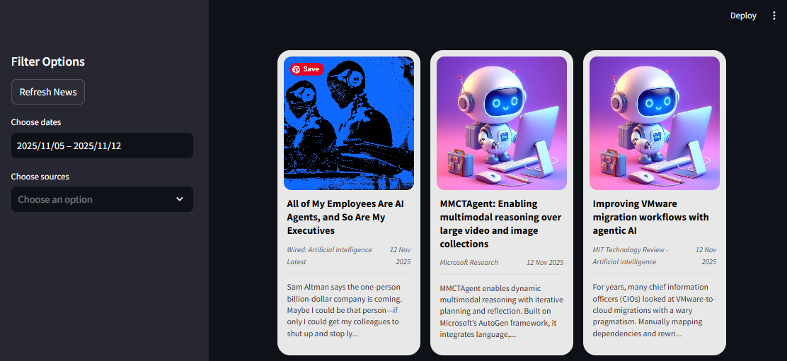
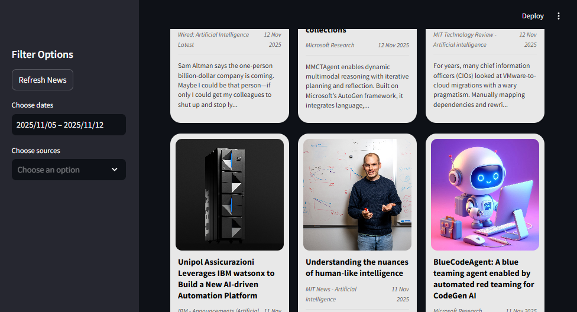

# Latest AI News

This repository serves as a curated collection of the most recent and significant developments in artificial intelligence. The goal is to provide AI enthusiasts, researchers, students, and professionals with a centralized resource to stay updated on breakthroughs, research papers, product launches, and industry trends.

## Contents

This repository includes:

- News about major AI product releases
- Updates on AI industry trends
- Insights from AI conferences and events
- Resources for learning about new AI technologies

## Screenshots

## ✨ Features

- **Modern Card-Based Interface**: News displayed in an elegant three-column grid layout
- **Responsive Design**: Works well on different screen sizes
- **RSS Feed Integration**: Automatically pulls content from top AI news sources
- **Smart Filtering**: Filter news by date range and source
- **Customizable View**: Select specific news sources or view all content
- **Real-time Updates**: Refresh data with a single click
- **Image Support**: Displays source images when available

## 💻 Technical Details

- **Framework**: Built with Streamlit for rapid development and easy deployment
- **Data Sources**: Aggregates news from 12+ leading AI publications including:
  - Google DeepMind Blog
  - OpenAI News
  - MIT Technology Review
  - NVIDIA Blog
  - Microsoft Research
  - The Berkeley AI Research Blog
  - And more...
- **Automatic Content Processing**: Handles different date formats and content structures
- **Parallel Processing**: Uses concurrent fetching for faster data retrieval
